# Introduction

Stardragon is an L3 certification rocket based on an Ultimate Wildman kit from Wildman Rocketry. It is a 6 in diameter, 12 foot tall
high power rocket kit. The rocket features a dual-redundant dual-sep-dual-deploy recovery system with a main and drogue
parachute, as well as an avionics bay housing dual (or triple) altimeters, a GPS tracker, a 900 MHz RF communications system, two cameras
and custom electronics for communications, cameras, data logging, power management, and a possible third SRAD altimeter. 

## Who am I?

Hi! My name is Evan Floyd (I go by Surge usually), a computer science senior at Virginia Commonwealth University. I joined Ram Rocketry,
VCU's rocketry club, when I was a freshman, and since then I've certified L1 and L2 rockets, competed with the team in BOTR in 2023, Spaceport 
America Cup in 2024, and IREC in 2025 and soon 2026. I've been the payload team lead for Spaceport/IREC since sophomore year, and learned 
so much about rocketry, electronics, and valuable leadership and teamwork skills. After completing my L2 certification in late October 2025, 
I decided to pursue an L3 certification to further challenge myself and continue my growth in my rocketry journey.

Outside of Rocketry, I am a linux system administrator for the College of Engineering at VCU, where I manage and maintain lab computers for researchers
and students across the school. I'm a programmer by trade, with plenty of experience working with C/C++, Python, and Rust, as well as plenty of 
electronics experience. I also do art, mainly digital art, and eventually hope to turn that into a side business. I enjoy
music, having played the clarinet family since 5th grade, and was in my high school's top concert band, marching band and VCU Pep Band. I'm a big star trek nerd,
and love science fiction in general. I also play table top games! 

::: {layout-ncol=2}

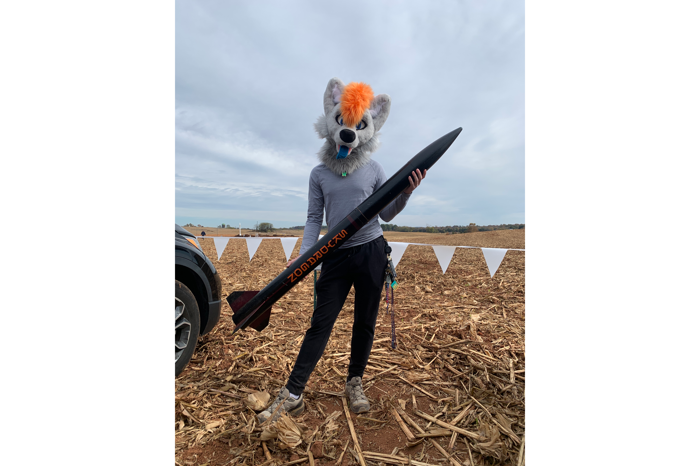

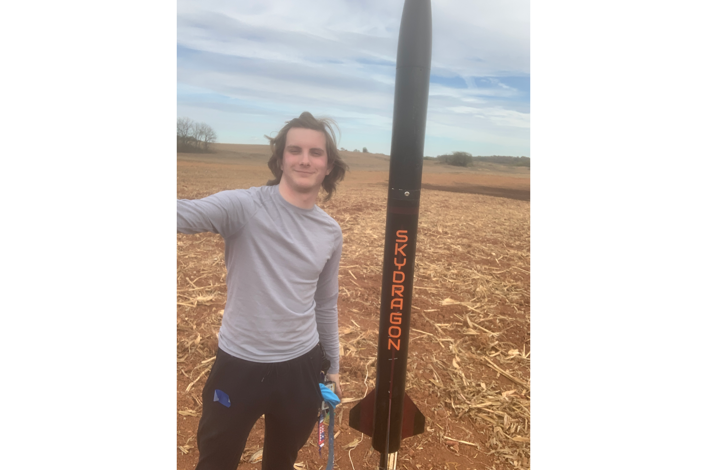

:::

Since launching Striker, my L1 rocket, I decided to pursue the remaining two certifications as I want to continue with high-power rocketry. I have
since launched SkyDragon, my L2 rocket, multiple times successfully with electronic dual-deployment and plan to launch a couple more times before I 
finish construction of Stardragon. In addition to programming, I do a lot of work with electronics, and am pursuing a custom avionics bay to test on
SkyDragon, and might test on Stardragon as well. I am looking forward to the challenge of L3 certification and all the learning opportunities it will
bring.

The names of my rockets (except Striker) are inspired by my fursona's lore. Skydragon is a class of aircraft in my fursona's world, and Stardragon is a FTL-capable
starship used primarily for exploration and research. Surge, my fursona and what I go by, was chief engineer behind the Dragon program repsonsible for
designing and building these advanced vehicles. The names reflect my love of science fiction and space exploration, as well as my passion for rocketry
(since dragon is the name of a real-world spacecraft too!).

# Stardragon

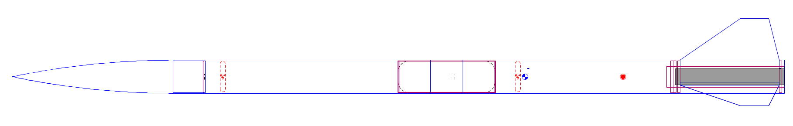

Stardragon's goal is to be a reliable, stable, and safe rocket that I can use to demonstrate my proficiency in high-power rocketry and achieve my
L3 certification. My goal is to make the airframe as simple as possible, using a stock Ultimate Wildman kit with minimal modifications.
The avionics bay will be custom designed to house all the necessary electronics, focusing on redundancy with two altimeters, a GPS tracker, and
dual cameras. The AV bay will be modular in design, such that I can add or remove modules based on what I wish to do, so I can install a second
GPS module, or a radio communications system for telemetry or video.

### Airframe

The airframe is a mostly stock Ultimate Wildman kit, with a camera mount to hold an FPV camera in the avionics bay. It is a fiberglass body with
a metal nose cone tip and fiberglass fins. The airframe is 6 inches in diameter and approximately 12 feet tall.
The certification flight will be flown on 75mm motors, using a 75-98mm adapter. There are three main components to the rocket: the fin can, the
av bay and upper body tube assembly, and the nose cone. Each section is rigged together with kevlar shock cords and strong quick links to keep the
rocket together during recovery, with couplers and shear pins to keep the rocket together while in flight.

### Recovery

The recovery system is a dual separation system with two parachutes. The drogue chute deploys at apogee, and main chute deploys at 800 ft AGL.
Each section of the rocket that separates will be held together with 4/40" shear pins, 2 for the fin can, and 4 for the nose cone. 2 for the 
fin can will be enough to ensure drag separation does not occur, and 4 will hold the nose cone in place for the drogue deployment.

To connect the parachutes to the airframe, the drogue chute is connected to the fin can with a kevlar shock cord and y-harness, with a swivel
and quick link to connect the chute itself. The other end of the shock cord is connected to the avionics bay and upper body tube assembly.
The main chute is connected to the avionics bay and nose cone with another kevlar shock cord. Attachment points on each bulkhead will be reinforced
with epoxy with fiberglass cloth cuttings to ensure strength. Each parachute will be packed within a fire cloth to prevent damage, each cloth attached
to the shock cord and wrapped burrito-style around the parachute. 

The drogue chute will be 36" and the main chute will be 144", with fire cloths to fit each chute inside securely and safely such that the parachutes
do not become damaged with the ejection charge fires. The 24" drogue chute is estimated at around 100 feet per second descent rate on OpenRocket, 
with the main being around 15 feet per second upon final touchdown. This isn't including drag, as OpenRocket does not simulate drag on the rocket.

Each parachute will be deployed using a separate ejection charge, consisting of a black powder charge and E-match. Each charge will be housed in
its own charge well (material tbd), mounted to the bulkheads with screws and plenty of epoxy. The drogue chute will be deployed first at apogee,
followed by the main chute at 500 ft AGL. Two charges will be present for each deployment, one for each altimeter, to ensure redundancy and to
make sure the parachutes deploy properly. The primary will fire first, followed by the backup after a slight delay (approximately 1-2 seconds). This
delay will be for both parachute deployments.

### Avionics

The avionics bay will house all the electronics for the rocket. The structural part of the bay will be a 6-inch coupler
tube, with removable fiberglass bulkheads on the forward and aft ends to allow for easy access to the electronics. The bulkheads will be
held in compression with 3/8 in. steel threaded rods, secured with nuts and washers, to provide the structural integrity needed to withstand the force of
the parachutes and ejection charges. Shock cords and quick links will be attached with U-bolts and reinforced with epoxy.

The AV bay internal structure will consist of a modular system inspired by rack-mount equipment. It will be designed to house the electronics on 
sleds that mount using a system that consists of rails designed into the 3D print, and m3 bolts to securely mount the sleds in place. Switches
will mount to a specially designed sled that goes in the middle of the av bay, where the switch band is. This sled will contain the two altimeters
as well as the tracker if the space permits, otherwise a second sled will be used to hold the tracker. Batteries will be mounted to the underside
of the sleds.

The internal section will be mounted to the aft bulkhead and threaded rods using nuts. The idea is it can easily be taken out to modify anything while keeping
the majority of structure in place, so you simply need to slide in the entire bay and attach the forward bulkhead. As such, wires for ejection charges
will have XT-30 connectors to allow them to easily be taken apart, with the female ends being on the bay itself.

Airflow for the barometric pressure sensors for the avionics will be handled by four 1/8" holes drilled equidistant around the switchband, with enough
ventilation inside with the bay itself to allow the sensors to pick up the pressure to ensure no misfiring. The bay will have voids in the switchband
area for this purpose.

## Electronics

The essential electronics will consist of two altimeters of different types, a GPS tracker, two key switches (one for the altimeter and one for the tracker), and
batteries for each board. Each altimeter will be powered by a 2s 18650 battery pack at 3000 mAh, and the tracker will be powered by a 1s battery.
Altimeters and the tracker will be powered on manually with a switch at the pad. On the bulkheads, there will be four wago connectors
to quickly connect and disconnect E-matches for ejection charges. The altimeters will be a Missileworks RRC3+ and a Featherweight BlueJay2.
The GPS tracker will be a Featherweight GPS tracker. The featherweight BlueJay2 contains its own magnet switch, so no additional switch is
needed for this altimeter, where the tracker and RRC3+ will each have their own key switch located internally in the AV bay, with holes where
the switches are to allow the switches to be operated.

In addition, there will be two cameras and an onboard communication system on the 900 MHz band. These devices will be powered by a separate
2s 18650 pack isolated from the essential electronics. One camera will face aft, mounted externally and covered by a shroud if necessary and
possible, and the other will face the horizon on the opposite side of the rocket. Cameras will be mounted to the switchband. A possible third
camera might be mounted facing aft for live video on 5.8 GHz. This is not included in the full schematic, as it is not decided if this camera
will be on board at this time.

The communication system will consist of an XBee radio connected to a Raspberry Pi Pico microcontroller. The purpose of this will be to include
live telemetry, as well as provide triggers to the non-live cameras to begin recording. The onboard XBee will be paired with a second one to
provide ground station functionality, including activating the cameras, collecting telemetry, and configuring other non-critical onboard systems.
Should the VTX be present on board, it will additionally include a screen and a matching VRX to receive the digital video and display it, as well
as record. The non live cameras are run by separate Raspberry Pi Zero 2W mini computers, using Camera Module 3's recording locally to their
connected computers. They are controlled by the pico using I2C. All three pi's will be configured to have a wifi network, with the pico's being
active upon power up and the zero 2ws' being controlled by the microcontroller. The purpose for these will be to configure the cameras, as well
as provide an alternate activation source if the 900 MHz radio fails or is disconnected for any reason, as well as to download the footage from
the Pis.

A full schematic of the electronics system is included in Appendix B. Below is a simplified block diagram of the essential electronics and what
will be inside regardless of design changes made.

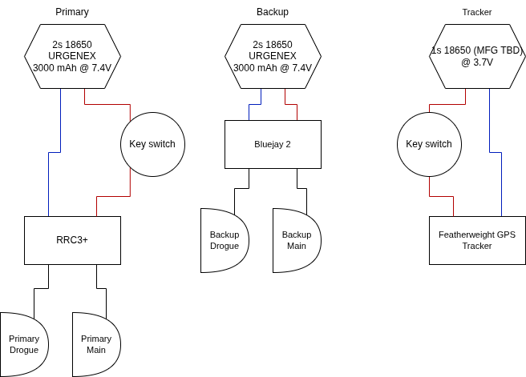

## Motor

Stardragon's motors are in the 75mm size class, with the intention to fly a test launch on an Aerotech Class L motor, and the actual certification
flight on a more powerful Class M motor. For the L motor, I plan on flying on a L1390G, up to a simulated apogee of 4,510 feet, and for the M motor
I plan on flying a M1550R to 6,585 feet. This puts both motors under the flight waiver of 7,000 feet AGL of the launch site I have selected.

## Launch Site

For both test and certification flights, I plan to launch from TCVA's battlepark launch site in Rapidan, VA. It is the closest site to me that
allows for 75mm motors and L3 certifications that has a waiver high enough for my simulated altitudes to reach. I do not expect to reach the
simulated altitude due to unaccounted for drag that might be present during the flights.

## Flight

This section outlines the process in which the flights will occur. Here is each stage of flight, from preflight to recovery, outlined in detail.
Detailed checklists are outlined in Appendix A. Below is a simplified but accurate diagram of the various stages of flight:

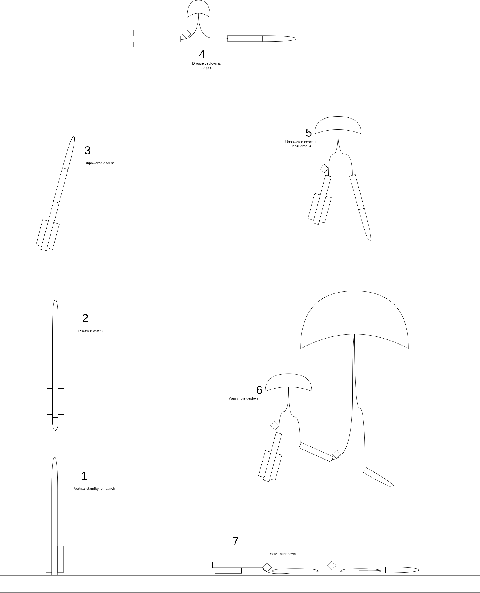

### Packing

The packing stage of flight takes place in the day or days leading up to the actual flight. This will consist of building the motor and configuring
the altimeters, checking wiring harnesses, inspecting the rocket for structural wear and fatigue, and other issues that will need to be resolved
prior to arrival to the launch site. 

### Preflight

Upon arrival to the launch site, the process of preflight will begin. The first step is to assemble the avionics bay and checking continuity, 
followed by wet assembling the entire rocket with the motor but without ejection charges to calculate dry CG. A removable sticker will be placed 
where this point is to be determined to denote the position of the center of gravity. Following this, the ejection charges and parachutes will
be packed and a final mass will be determined either at the RSO table during their inspection, or with my own equipment. Once RSO inspections
are complete and it is deemed fit for launch, we can power on the non-critical electronics. The preflight stage is complete.

### Pad

Once approved and we have arrived at the launch pad, we will begin by putting the rocket on the launch rail and getting it vertical. Following this,
altimeters will be powered on one at a time to ensure continuity against the E-matches present in the ejection charges. Once continuity is determined,
keys are removed from the rocket and held onto for the remaining duration of the flight. Launch site communications box will be switched OFF to safely
install the igniter for the motor. Comms box can then be switched ON, and the continuity checked on the igniter from the box. Any additional cameras
can be set up at this point, photos taken, and then back to the safety zone.

### Deployment Events

Once launched, altimeters will be active above 30 ft AGL. The telemetry transmission will begin showing more valid altitude data. Once apogee is reached,
the first of two deployment events will occur, and the drogue chute will be deployed. The rocket will drift under drogue until around 1000 ft AGL, in
which the main parachute will be deployed. The rocket will then drift under main until touchdown, in which the transmission of data will stop and the
altimeters will go to altitude readout until shut off.

#### Backups

Each deployment event will have a backup charge that will fire one to two seconds after the primary charge, powered by the backup altimeter. This is to
ensure the parachutes deploy, even if the primary charge fails to fire.

### Recovery

Upon reaching the rocket post-flight, safing will occur, which will involve first getting a readout of the final altitude of each altimeter for
recordkeeping purposes, then turning the key switches to the OFF position. A signal will then be sent on the 900 MHz comms system to stop recording
and power down the camera system. Inspection of the charge wells will then take place to ensure that all charges detonated successfully, then shock
cords will be detached from the nose cone and av bay for transport back to the launch site.

# Appendix A: Checklists

The following sections are the checklists that will be followed for each launch of Stardragon.

### Packing

The packing checklist will be completed in the day(s) leading up to launch day.

- [ ] PACKING CHECKLIST - Pack all items under this category to take to the launch site
  - [ ] Avionics Bay
    - [ ] Altimeter 1
    - [ ] Altimeter 2
    - [ ] Altimeter 3 (optional, could be research or backup altimeter)
    - [ ] GPS
    - [ ] E-Matches
    - [ ] Black Powder
    - [ ] Dogbarf (shredded insulation, used for packing ejection charge wells)
    - [ ] Extra keys
    - [ ] Extra key switches
    - [ ] Extra wire (solid and stranded, black and red at least)
    - [ ] Battery powered soldering iron
    - [ ] Electrical Tape
  - [ ] Fin Can
    - [ ] Motor
    - [ ] Motor retainer ring
    - [ ] Thrust plate?
    - [ ] 
  - [ ] Nose Cone
  - [ ] Upper Body Tube
  - [ ] Parachutes
    - [ ] Drogue
    - [ ] Main
    - [ ] Fire cloths
- [ ] Test all electronics
- [ ] Charge batteries
- [ ] Build motor

### Integration and Preflight

The integration and preflight checklist will be completed at the launch site prior to check-in with the Range Safety Officer(s).

- [ ] Assemble avionics bay
- [ ] Final check avionics, continuity checks
- [ ] Connect AV bay shock cords
- [ ] Install motor
- [ ] Install AV bay to upper body tube
- [ ] Wet assemble rocket (No ejection charges)
- [ ] Measure CG, mark on body tubes
- [ ] Uninstall AV bay and remove shock cords
- [ ] Pack ejection charges
- [ ] Reinstall AV bay and shock cords
- [ ] Pack parachutes
- [ ] Final mass and CG measurement
- [ ] RSO inspection and approval

### Pad

The pad checklist will be completed at the pad after the RSO has determined the rocket fit for launch. Final G-NG call.

- [ ] Install rocket on launch rail and raise to vertical
- [ ] Initialize electronics
  - [ ] Altimeter 1; continuity check
  - [ ] Altimeter 2; continuity check
  - [ ] Altimeter 3 (if present)
  - [ ] GPS
  - [ ] Extra electronics if present
- [ ] Remove keys and keep in possession
- [ ] Launch comms box to OFF
- [ ] Install igniter
- [ ] Launch comms box to ON
- [ ] Continuity check igniter from launch box
- [ ] Set up cameras if present
- [ ] Go to safety zone

### Postflight Safing and Inspection

The postflight safing and inspection checklist will be completed once the rocket has been found and actively being recovered. Inspections
will ensure the rocket has not suffered catastrophic damage and can be flown again with minimal turnaround.

- [ ] Retrieve cameras from launch pad if present
- Once rocket found...
- [ ] Get altitude readout from altimeters
- [ ] Send shutdown signal to comms system
- [ ] All electronics to OFF (key switches to OFF position)
- [ ] Inspect ejection charges
  - Should a charge have failed to fire:
  - [ ] Follow e-match safety protocol to safely disarm e-match
- [ ] Detach shock cords from nose cone and AV bay
- [ ] Transport rocket back to launch site for post-flight inspections

#### Inspection (Post RSO)

- [ ] Check body tubes for zippering or cracks
- [ ] Check couplers for cracks or damage
- [ ] Check launch lugs for wear, damage, or completely pulled off
- [ ] Check fins for cracks on fillets or root edges
- [ ] Check for cracks on the fins
- [ ] Check bulkheads for cracks or separation of the attachment hardware
- [ ] Check nose cone for cracks or damage to the tip
- [ ] Uninstall motor and inspect motor mount
- [ ] Inspect avionics bay for damage
- [ ] Inspect electronics for damage
- [ ] Inspect parachutes for any rips, tears, or burns
- [ ] Inspect fire cloths for damage

### Postflight abnormal flight

In the event of an abnormal flight, such as a cato or a premature ejection of one or both parachutes, these checklists will take place to 
ensure the proper safing of the rocket post-flight.

#### Cato

A cato is when the motor's casing fails either at the seals or the casing itself, causing high pressure gas to suddenly expel from the
rupture. Should this happen, this checklist is to be run.

- [ ] Bring fire equipment to extinguish any flames or smoldering on, around, and in the path of the rocket
- When reached the rocket
- [ ] Disarm avionics, if still armed and active
- [ ] Extinguish fires, if present
- [ ] Detach upper portion of rocket and uninstall e-matches from wago connectors, if not already fired
- [ ] Transport back to the launch site 
- [ ] Remove ejection charges, if not already fired
- [ ] Full inspection of the rocket to determine what happened to the motor, the damage, and what and how to fix, if possible to do so

### Scrub

The scrub checklist will be for any event where the rocket was prepped for launch, but a launch is no longer possible due to any reason.

- [ ] Launch comms box to OFF
- [ ] Uninstall igniter
- [ ] Shutdown signal to comms system
- [ ] All electronics to OFF (key switches to OFF position)
- [ ] Launch rail to horizontal
- [ ] Transport rocket back to launch site
- [ ] Remove motor from rocket
- [ ] Carefully remove AV bay and shock cords
- [ ] Disconnect e-matches from wago connectors
- [ ] Electrical tape e-match leads
- [ ] Remove parachutes and re-pack for quick turnaround next available launch

### Reset

The reset checklist will be for any event where the rocket is on the pad ready but needs to be reset, i.e. igniter failure.

In general, these steps are followed with each reset:

- [ ] Launch comms box to OFF
- [ ] Remove igniter from motor

#### Igniter Failure

In the event of an igniter failure, the following steps are taken:

- [ ] Remove existing igniter from the ignition system
- [ ] Install new igniter
- [ ] Insert new igniter into motor

#### Final reset

After all steps are taken as needed above, the following steps are taken:

- [ ] Launch comms box to ON
- [ ] Continuity check igniter from launch box
- [ ] Go to safety zone

# Appendix B: Schematics 

## OpenRocket simulation results

Both L and M motor simulation results are below, including speed information and apogee. Sims are set to roughly the latitude/longitude
of the TCVA Battlepark launch site, N38.4 W78.1, with the launch rail set to 16 feet. The rail length will be adjusted according to
the physical build of the rocket and the placement of the unistrut rail buttons. Stability results are also shown, as well as statistics
for the motor including flight time, apogee, max acceleration, and more.

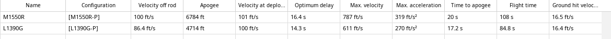

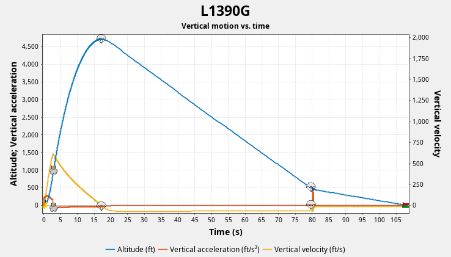

::: {layout-ncol=2}
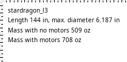

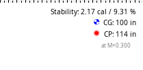
:::

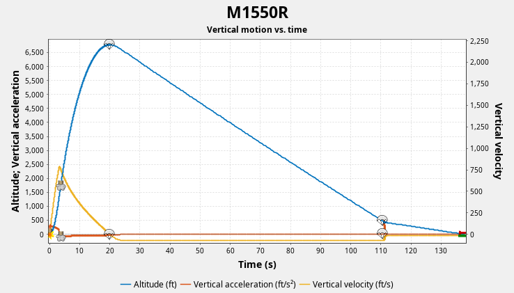

::: {layout-ncol=2}
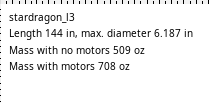

:::

## Complete AV bay electrical schematics

This schematic includes the camera systems, as well as the avionics. Avionics are part of separate circuts than the cameras, to ensure
reliability with the avionics.

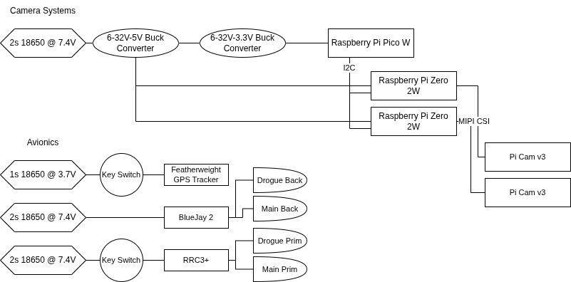

## Recovery Diagram

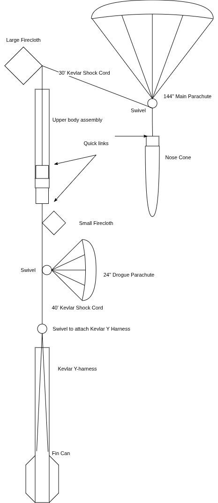
